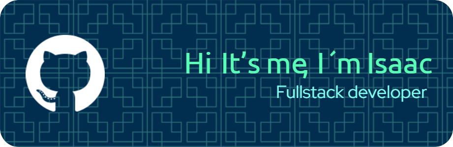

# Welcome to Isarok's GitHub 

	

<h3 align="center">I am Isaac, a beginner in the IT world, where every day is an opportunity to learn and grow.</h3>

This repository was created to share, contribute to, and learn from Full-Stack web development projects that showcase our teamwork and make us proud. 

### Skills

 
  
   
     
     
    
       
     
    

<h4 align = "center"> Always willing to collaborate on interesting projects. Feel free to reach out if you'd like to work together. </h4>

